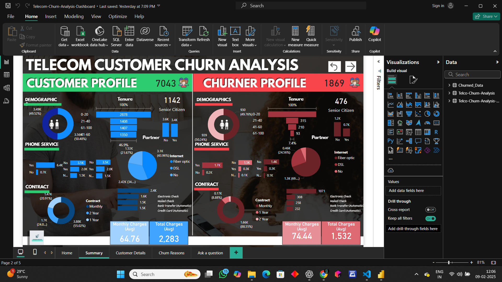

# Customer Churn Analysis

A comprehensive project analyzing customer churn using Python for data processing and machine learning, and Power BI for visualization.

---

## 📌 Overview

Customer churn analysis is a critical process that helps businesses understand why customers leave and how to retain them. This project utilizes **Python** and **Power BI** to analyze churn patterns, visualize insights, and predict potential churn using machine learning models.

---

## 🚀 Features

- 📊 **Data Cleaning & Preprocessing** – Handling missing values, outliers, and feature engineering.
- 🔍 **Exploratory Data Analysis (EDA)** – Uncovering trends and correlations in churn behavior.
- 🤖 **Machine Learning Models** – Implementing predictive models such as Logistic Regression, Decision Trees, and Random Forest.
- 📈 **Power BI Dashboards** – Creating interactive visualizations for better business insights.
- 📉 **Churn Prediction** – Identifying high-risk customers to improve retention strategies.

---

---

## 🛠 Technologies Used

- **Python**: Pandas, NumPy, Scikit-Learn, Matplotlib, Seaborn
- **Power BI**: Data visualization and dashboarding
- **Jupyter Notebook**: For data processing and modeling
- **Machine Learning Models**: Logistic Regression, Decision Tree, Random Forest, XGBoost

---

## 📂 Project Structure

```
customer-churn-analysis/
│
├── dataset.csv               # Raw customer data
├── churn_analysis.ipynb      # Data preprocessing & ML model training
├── PowerBI_Report.pbix       # Power BI dashboard file
```

---


### Run Analysis

1. Open **Jupyter Notebook** and run `churn_analysis.ipynb`.
2. Load the dataset and preprocess data.
3. Train machine learning models to predict churn.
4. Open `PowerBI_Report.pbix` in **Power BI** for visualization.

---

## 📊 Power BI Dashboard

- **Customer Segmentation** – Identifying patterns in customer behavior.
- **Churn Trends** – Understanding key factors affecting churn.
- **Predictive Insights** – Visualizing machine learning results.

---

## 🤝 Contributing

Contributions are welcome! If you'd like to improve this project, follow these steps:

1. Fork the repository.
2. Create a new branch (`feature-branch`).
3. Commit your changes.
4. Submit a pull request.

---


